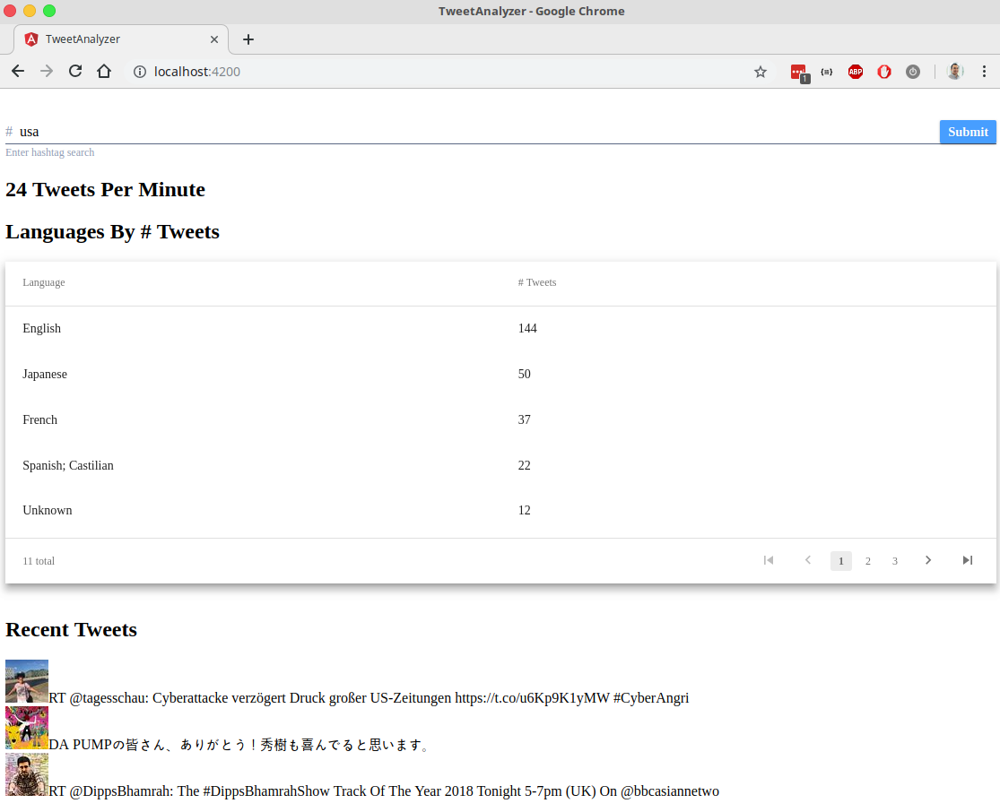

# TweetAnalyzer

Real time tweet aggregator by language and previewer via hashtag search.

## Running app locally

1. `npm i` to install dependencies
2. Create `.env` file in root directory by copying `.env-example` file and populate Twitter app auth credentials
3. Run backend API using `node server/server.js`
4. Run web app using `npm run start`

## Author
Will Garcia (contact@thewillg.com)